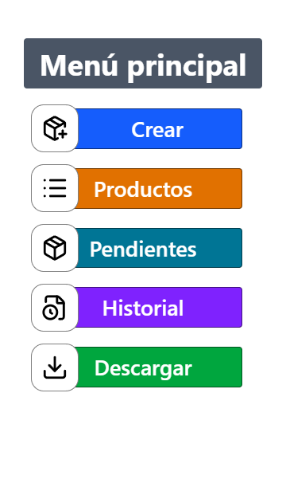
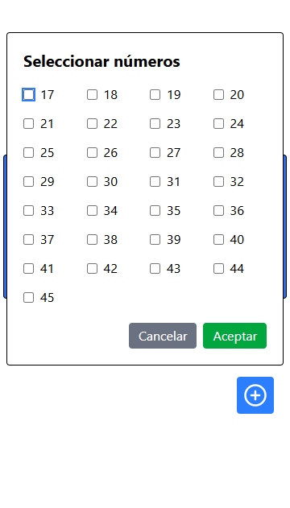
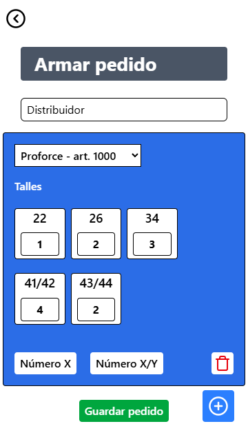
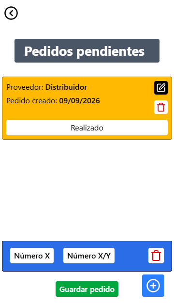
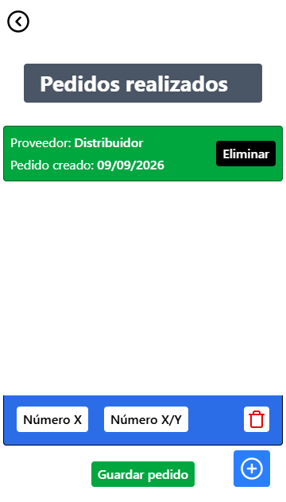

# 📦 Pedido App

Aplicación móvil para la **gestión y armado de pedidos** para locales de venta de calzados.

La aplicación permite crear pedidos, seleccionar marcas y artículos, definir numeraciones y cantidades de pares, modificar pedidos pendientes y marcar pedidos como realizados para conservarlos posteriormente en un historial.

El historial de pedidos puede exportarse en formato `.xlsx` para facilitar su gestión y almacenamiento.

---

## 📸 Capturas de pantalla

<p align="center">
  
  
  
  
  
</p>

## ✨ Características

* 📝 Creación de pedidos mediante un título.
* 👟 Selección de marcas y artículos.
* 🔢 Selección de numeraciones disponibles.
* 📦 Definición de cantidad de pares por numeración.
* ✏️ Edición de pedidos pendientes.
* ⏳ Gestión de pedidos pendientes.
* ✅ Marcado de pedidos como realizados.
* 📚 Historial de pedidos realizados.
* 📊 Exportación del historial a archivos `.xlsx`.
* 💾 Persistencia de los datos en el dispositivo.
* 📱 Aplicación preparada para ejecutarse como aplicación móvil Android.

## 🔄 Flujo de trabajo

El flujo principal de la aplicación es el siguiente:

```text
Crear pedido
     │
     ▼
Agregar productos
     │
     ├── Marca
     ├── Artículo
     ├── Numeración
     └── Cantidad de pares
     │
     ▼
Pedido pendiente
     │
     ├── Modificar pedido
     │
     ▼
Marcar como realizado
     │
     ▼
Historial
     │
     ▼
Exportar a XLSX
```

### 1. Crear un pedido

El usuario crea un nuevo pedido indicando un título identificativo.

El pedido se crea inicialmente con estado **pendiente**.

### 2. Agregar productos

Dentro del pedido, el usuario puede seleccionar:

* Marca.
* Artículo.
* Numeraciones.
* Cantidad de pares para cada numeración.

### 3. Modificar un pedido

Mientras el pedido permanezca pendiente, el usuario puede modificar su contenido.

Esto permite agregar, quitar o modificar productos antes de finalizar el pedido.

### 4. Marcar como realizado

Cuando el pedido ya fue realizado, el usuario puede cambiar su estado a **realizado**.

Una vez realizado, el pedido pasa a formar parte del historial.

### 5. Historial

Los pedidos realizados quedan almacenados en el historial.

Desde allí, el usuario puede consultar los pedidos completados y exportarlos a un archivo Excel (`.xlsx`).

## 🛠️ Tecnologías utilizadas

### Frontend

| Tecnología        | Uso                                      |
| ----------------- | ---------------------------------------- |
| **React 19**      | Construcción de la interfaz de usuario.  |
| **TypeScript**    | Tipado estático y desarrollo más seguro. |
| **React Router**  | Navegación entre las diferentes vistas.  |
| **Tailwind CSS**  | Estilos y diseño de la interfaz.         |
| **Framer Motion** | Animaciones y transiciones.              |
| **Lucide React**  | Iconos.                                  |
| **Radix UI**      | Componentes de interfaz accesibles.      |

### Aplicación móvil

| Tecnología                | Uso                                                       |
| ------------------------- | --------------------------------------------------------- |
| **Capacitor**             | Integración de la aplicación web con plataformas móviles. |
| **Capacitor Android**     | Generación y ejecución de la aplicación para Android.     |
| **Capacitor Preferences** | Persistencia de información en el dispositivo.            |
| **Capacitor Filesystem**  | Manejo de archivos desde la aplicación.                   |

### Exportación

| Tecnología           | Uso                                                                 |
| -------------------- | ------------------------------------------------------------------- |
| **SheetJS (`xlsx`)** | Generación y exportación del historial de pedidos en formato Excel. |

### Herramientas de desarrollo

| Herramienta             | Uso                                  |
| ----------------------- | ------------------------------------ |
| **Vite**                | Entorno de desarrollo y build.       |
| **ESLint**              | Análisis y calidad del código.       |
| **TypeScript Compiler** | Compilación y verificación de tipos. |

## 🚀 Instalación

### Requisitos

Antes de comenzar, es necesario tener instalado:

* Node.js
* npm
* Android Studio, si se desea ejecutar o compilar la aplicación para Android.

### Clonar el repositorio

```bash
git clone https://github.com/EzeBelmonte/pedidos-reposicion-negocio.git

cd pedidos-reposicion-negocio

cd pedido-app
```

### Instalar dependencias

```bash
npm install
```

## 💻 Desarrollo

Para iniciar el servidor de desarrollo:

```bash
npm run dev
```

Vite iniciará la aplicación en modo desarrollo.

## 🔎 Lint

Para analizar el código utilizando ESLint:

```bash
npm run lint
```

## 🏗️ Build

Para generar una versión de producción:

```bash
npm run build
```

Este comando verifica y compila el proyecto con TypeScript y posteriormente genera el build de producción utilizando Vite.

## 📱 Android

La aplicación utiliza **Capacitor** para empaquetar el frontend como una aplicación Android.

Después de generar el build, se puede sincronizar el proyecto con Android mediante:

```bash
npx cap sync android
```

Para abrir el proyecto Android en Android Studio:

```bash
npx cap open android
```

Desde Android Studio se puede ejecutar la aplicación en un dispositivo físico o emulador y generar el APK/AAB correspondiente.

## 📊 Exportación de pedidos

El historial de pedidos puede exportarse a formato Excel mediante la librería `xlsx`.

El archivo generado utiliza la información de los pedidos realizados y permite disponer de los datos en un formato fácilmente editable y compatible con herramientas como Microsoft Excel o Google Sheets.

## 💾 Persistencia

La aplicación utiliza almacenamiento local del dispositivo para conservar la información de los pedidos.

Para esto se utilizan las APIs de Capacitor, permitiendo que los datos permanezcan disponibles entre sesiones de uso de la aplicación.

## 📌 Estados de los pedidos

Los pedidos manejan principalmente dos estados:

|    Estado   | Descripción                                                             |
| :---------: | ----------------------------------------------------------------------- |
| ⏳ Pendiente | El pedido todavía puede ser modificado y no fue marcado como realizado. |
| ✅ Realizado | El pedido fue completado y pasa a formar parte del historial.           |

## 🎯 Objetivo del proyecto

El objetivo de **Pedido App** es simplificar y digitalizar la creación y gestión de pedidos dentro de un local de venta de calzados.

La aplicación busca reemplazar procesos manuales, como anotaciones en papel o planillas independientes, por una herramienta móvil que permita organizar los pedidos de manera rápida y centralizada.

## 🔮 Posibles mejoras futuras

Algunas funcionalidades que podrían incorporarse en futuras versiones:

* 🔍 Búsqueda y filtrado de pedidos.
* 📅 Filtrado del historial por fecha.
* 🏷️ Gestión más avanzada de marcas y artículos.
* 📈 Estadísticas de pedidos y productos.
* ☁️ Sincronización con la nube.
* 👥 Usuarios y autenticación.
* 🔄 Sincronización entre diferentes dispositivos.
* 📤 Más formatos de exportación.
* 🖨️ Impresión de pedidos.
* 🌙 Modo oscuro.

